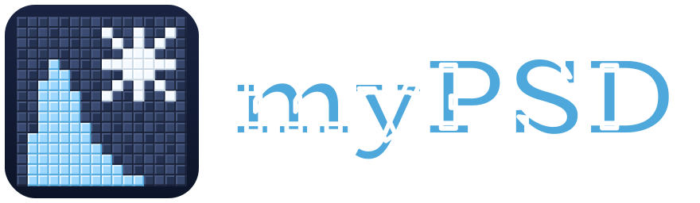

<p align="center">
  
</p>

# myPSD — interactive polarimetric radar PSD explorer

**Try it live:** [huggingface.co/spaces/swnesbitt/myPSD](https://huggingface.co/spaces/swnesbitt/myPSD)

myPSD is a teaching and exploration tool that shows how the shape of a
precipitation particle size distribution (PSD) translates into the observables
a dual-polarization weather radar actually sees. You pick a PSD and a
precipitation type, and the app computes the full size spectrum together with
eleven polarimetric metrics (Zh, Zdr, Kdp, ρhv, LDR, δ, attenuation, Nt,
LWC/IWC, and more) using T-matrix scattering in real time.

It accompanies **ATMS 410 — Radar Meteorology** at the University of Illinois
Urbana-Champaign and the textbook
[*Radar Meteorology: A First Course*](https://onlinelibrary.wiley.com/doi/book/10.1002/9781118432662)
(Rauber & Nesbitt, 2018).

This is a public web app hosted on **Hugging Face Spaces** as a Docker
container — no install, no account required. Source lives at
[swnesbitt/myPSD](https://github.com/swnesbitt/myPSD) on GitHub; every push
to `main` auto-deploys to the Space.

## What it does

For a given PSD, particle type, and radar wavelength, myPSD:

1. Builds (or reuses from cache) a **T-matrix scatter table** via
   [rustmatrix](https://github.com/swnesbitt/rustmatrix), a Rust port of
   pytmatrix, using habit-appropriate axis ratios and refractive indices.
2. Integrates the normalized-gamma PSD
   (N(D) = Nw·f(μ)·(D/Dm)^μ·exp[−(4+μ)D/Dm]; Testud et al. 2001) against
   that scatter table.
3. Returns both the **N(D) curve** (log concentration vs. diameter) and a
   **metrics table** of the polarimetric observables a radar at that
   wavelength would measure.

Supported precipitation types:

- **Rain** — oblate drops, Beard & Chuang (1987) axis ratios, water at 10 °C
- **Hail** — near-spherical solid ice, D up to 75 mm
- **Sector-plate snow** — low-density plates
- **6-point bullet rosettes** — sparse ice volume fraction
- **Bullet-rosette aggregates** — Brandes et al. (2007) ρ(D)

Snow habits use the Honeyager (2013) spheroid-proxy approach: a
Maxwell-Garnett ice-in-air effective medium is built per-diameter, so the
T-matrix stays tractable while capturing the density variation that drives
Zdr and ρhv for realistic snow.

## Using the interface

**Controls** (left column):

- **Precipitation type** — pick a habit. The particle shape, density model,
  and D_max are set automatically.
- **Radar wavelength** — S (10 cm), C (5 cm), or X (3 cm) band.
- **Dm (mm)** — mass-weighted mean diameter. Shifts the PSD peak.
- **log₁₀ Nw (mm⁻¹ m⁻³)** — Testud normalization intercept. Scales total
  concentration without changing spectral shape.
- **μ (shape)** — gamma shape parameter. Positive μ narrows the
  distribution; negative μ fattens the small-D tail.
- **Canting σ (deg)** — standard deviation of the orientation distribution.
  Larger σ reduces Zdr and Kdp and raises LDR.

**Presets** (below the sliders) — one-click jumps to canonical archetypes
from the literature: drizzle, light stratiform rain, continental/maritime
convection, light plate snow, heavy aggregates, and a 70 dBZ hail core.
Each button shows its source citation. Nudging any slider deselects the
preset.

**PSD plot** — N(D) on a log scale, shaded by total concentration. The
x/y range fields below the plot let you zoom. Hover the Definitions row
above the plot for the math behind the axes.

**Metrics table** — polarimetric observables at the chosen band, with a
hover tip on each row explaining what the metric tells you physically.

**Assumptions** — the per-species panel at the bottom lists the scattering
assumptions that are currently active (refractive index, axis-ratio model,
D_max, density law), with literature citations. This is deliberately always
visible: the numbers above are only as good as the assumptions under them.

## Local development

You only need this if you want to modify the code. The public app runs on
Hugging Face and doesn't require anything local.

### Backend

```bash
cd backend
uv venv
uv pip install -e .
uv run uvicorn app.main:app --reload --port 8000
```

### Frontend

```bash
cd frontend
npm ci
npm run dev
```

The Vite dev server proxies `/api` to `localhost:8000`. Production builds
output to `backend/app/static/`, which FastAPI serves from the same origin.

### Docker (simulates HF Spaces)

```bash
docker build -t mypsd .
docker run --rm -p 7860:7860 -e HOME=/tmp mypsd
# open http://localhost:7860
```

## Stack

- **[rustmatrix](https://github.com/swnesbitt/rustmatrix)** — Rust-backed
  T-matrix scattering (drop-in `pytmatrix` replacement)
- **FastAPI** — thin JSON API over the scatterer
- **React + Vite + Mantine + Plotly.js** — interactive single-page frontend
- **Docker on Hugging Face Spaces** — deployment
- **GitHub Actions** — auto-sync `main` → the HF Space

Branded with the [CLIMAS](https://climas.illinois.edu/) group icon.

## Attribution

- **myPSD** concept & original Bokeh app: Steve Nesbitt, University of
  Illinois Urbana-Champaign.
- **pytmatrix** (the original T-matrix Python wrapper): Jussi Leinonen,
  MeteoSwiss.
- **rustmatrix**: Rust port of the pytmatrix numerical core.

Full literature references for every physics choice are listed in the
**References** panel at the bottom of the live app.
